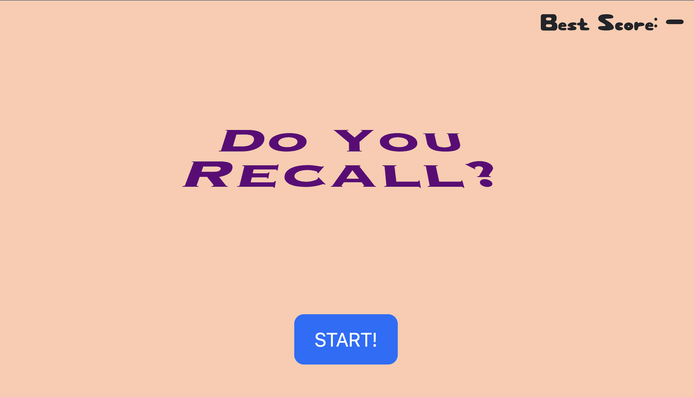
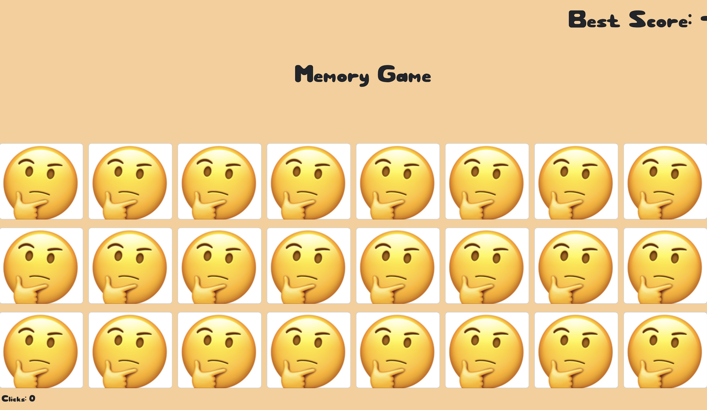

<!-- PROJECT LOGO -->
 

  
  <h3 align="center">WHAT TO DO?</h3>

  

    A card game that tests a users memory skills and challenges them to match up identical cards. A very fun game that was developed using HTML/CSS/JavaScript.
     
    <a href="https://do-you-recall.hasanabdulla.repl.co/"><strong>HOME PAGE</strong></a>
  

<!-- TABLE OF CONTENTS -->

  
Table of Contents

  <ol>
    <li>
      <a href="#about-the-project">About The Project</a>
    </li>
    <li><a href="#contact">Contact</a></li>
  </ol>

<!-- ABOUT THE PROJECT -->
## About The Project

"Do You Recall?" is a wonderful game that tests a users memory and challenges them in both speed and with clicks. This game takes competition and remembrance to a whole new level!
<!-- CONTACT -->
## Contact

Your Name - [Hasan Abdulla](https://www.linkedin.com/in/hasan-abdulla1903/) - ishabdulla26@gmail.com

Project Link: [https://github.com/hAbdulla19/Do-You-Recall](https://github.com/hAbdulla19/Do-You-Recall)
